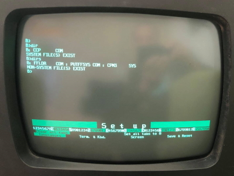
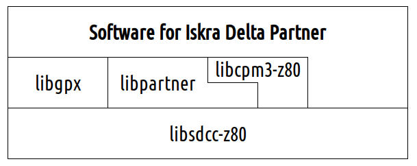
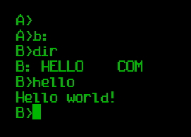

![status.badge] [![language.badge]][language.url] [![standard.badge]][standard.url] [![license.badge]][license.url]

# idp-dev

Welcome to the **idp-dev**, the Iskra Delta Partner SDK. 

 

We are a group of volunteers interested in preserving our digital heritage. 
We provide tools and tutorials to developers writing software for the 
*Iskra Delta Partner* computer. 

We maintain repositories:

 * **idp-dev**. This repository.
 * [idp-doc.](https://github.com/tstih/idp-doc) Documentation archive.
 * [idp-games.](https://github.com/mgrcar/idp-games) Games.

 > If you'd like to donate old Iskra Delta Partner, Gorenje Dialog 
 > or Triglav hardware, please consider donating to us.

# Cloning this repository

This repository **contains submodules**; clone it with `--recurse-submodules.`

~~~
git clone https://github.com/tstih/idp-dev.git --recurse-submodules
~~~

# Table of Contents

- [The SDK](#the-sdk)
  * [Libraries](#libraries)
  * [The Architecture](#the-architecture)
  * [Current Status](#current-status)
  * [Building](#building)
    + [Prerequisites](#prerequisites)
    + [Make](#make)
      - [Other make targets](#other-make-targets)
  * [Hello World](#hello-world)
  * [The test framework](#the-test-framework)
- [Creating Disks Manually](#creating-disks-manually)
  * [How to create a hard drive?](#how-to-create-a-hard-drive-)
  * [How to create a floppy drive?](#how-to-create-a-floppy-drive-)
  * [How to add local files to disk?](#how-to-add-local-files-to-disk-)
  * [How to remove files from disk?](#how-to-remove-files-from-disk-)
- [The Emulator](#the-emulator)

# The SDK

## Libraries

Our initial project was *the C runtime*, consisting of a **C compiler** and a **Standard C library**. We adjusted the [SDCC compiler suite](http://sdcc.sourceforge.net/) to produce executables for the *Iskra Delta Partner* and wrote the standard library.

Later we realized that the wider retro community, using various *Z80* machines and *CP/M* systems, could benefit from our work and we separated it into four projects:

 * [libsdcc-z80](https://github.com/tstih/libsdcc-z80) is a library for bare metal programming
   with *SDCC*. You can use it to write programs from scratch for any *Z80* platform. Navigate to it to find out what it does and how to use it.

 * [libcpm3-z80](https://github.com/tstih/libcpm3-z80) is a platform-independent 
   *Standard C library* for *CP/M 3*. If you are interested in how a `.com` program for
   CP/M is created, and what parts of *the Standard library* are implemented? You'll find 
   the answers to your questions here.

 * **libpartner** provides access directly to *Partner* hardware. It also injects platform-specific functions into the *libcpm3-z80*, enabling extended features, such as managing
   the system time. This library is now the only *native* part of the `idp-dev` repository. 
   All other libraries are now separate git submodules.

 * [libgpx](https://github.com/tstih/libgpx) is an early version of a platform-independent library 
   for graphics, current targeting Iskra Delta Partner and ZX Spectrum 48K. 

## The Architecture

The following figure shows interdependencies between the submodules.

 

All libraries and software require `libsdcc`. Partner programs require `libcpm3-z80`, and 
this library obtains native functions (such as reading and writing the system clock!) from 
`libpartner.` The `libgpx` is by design a multiplatform library, and it brings its own 
graphical drivers ... hence no dependencies to `libpartner.`

## Current Status

| Module                     | Status (complete) |
|----------------------------|-------------------|
| The SDCC auxiliary library | |
| The Standard C library     | |  
| The Partner library        | |
| The Graphics library       | |

When we say a library is 100% completed, it means that we implemented everything that was 
initially planned, not 100% compliance with the standard.

At present

We are still working on the mouse functions for the Partner library, primarily because 
we don't have a test environment, and we're waiting for more advanced emulation updates.

## Building

### Prerequisites

At present, the build environment is *Linux* with the following tools installed: 
`sdcc,` `cpmtools,` `gcc,` and `sed.` 

 > The *Standard C Library* requires the latest version of *SDCC* (**4.1.6**). 
 > You are going to have to [build it from the sources]
 > (http://sdcc.sourceforge.net/). To make things more complicated, 
 > the build process also requires an exact version of the `automake` tools 
 > (**1.16.2**) and will not compile with other versions.
 > Newer versions will also work. 

### Make

Compile everything with 

`make`

After you are done compiling, create a disk image for the emulator with

`make install`

All output will go to the `build` folder. Disk image that you 
can import into the Partner emulator (using **Alt+O**) is called `fddb.img`.

#### Other make targets

For comfortable work, you can also use the following targets. Each
of them creates a `bin` folder copies the `.com,` `.lib` and `crt0cpm.rel` 
files into it. And then creates an image of the floppy disk called 
`fddb.img` with all the `.com` files to the floppy image, 
   

 * `make install` Create the `bin` folder and standard floppy (with `.com` files).
 * `make ccp` Add `ccp.com` to the floppy. CP/M allows programs to overwrite its'
   command shell called the CCP. When the program ends, the CP/M reloads the shell
   and, if not present on the disk, displays an error (prompts for disk change). 
 * `make boot` Uses a bootable floppy for *std. partner* as a base for creating
   the disk image. 
 * `make bootg` Uses a bootable floppy for *graphical partner* as a base for
   creating the disk image
 * `make dex` Calls `make install` and copies the floppy image to a user
   folder (`~/Dex/`). Use this if you work in *Linux* and need to exchange 
   the image with another environment (i.e., a *Windows* where the emulator
   is running). *In case you wonder, dex stands for Data EXchange.*

## Hello World

If you want to add and compile **your program**, please consult 
the `test/hello` sample inside this repository and the 
[libcpm3-z80](https://github.com/tstih/libcpm3-z80) documentation.

The "Hello World" sample does what every **Hello World** program in the world 
should do. It prints **Hello world!**

## The test framework

Automated unit tests use the [tiny test framework of Eric Radman](https://eradman.com/posts/tdd-in-c.html), 
based on [the original MinUnit by John Brewer](http://www.jera.com/techinfo/jtns/jtn002.html). 
The name of automated unit tests ends in `-test` (i.e. `std-test.com`).

# Creating Disks Manually

If you want to create custom Partner disks, we've prepared the necessary 
definitions for you to use with the `cpmtools` package.

You can download the package from here.

http://www.moria.de/~michael/cpmtools/

Disk definitions for Partner floppy and hard drives are in
the `scripts\diskdefs` file.
 * `idpfdd` for floppy drive
 * `idphdd` for the hard disk

## How to create a hard drive?

Note: `-f` is disk format and can be `idphdd` or `idpfdd`.

`mkfs.cpm.exe -f idphdd -t hdda.img`

## How to create a floppy drive?

`mkfs.cpm.exe -f idpfdd -t fddb.img`

## How to add local files to disk?

Following command adds file `hello.com` to area 0: of floppy drive `fddb.img`.

`cpmcp -f idpfdd fddb.img test.com 0:test.com`

## How to remove files from disk?

`cpmrm -f idpfdd fddb.img 0:test.com`

# The Emulator

You can download the emulator from here.

http://matejhorvat.si/sl/slorac/delta/partner/index.htm

Inside the emulator, press Alt+O to attach your disk image. 
The emulator maps the attached disk as `B:` drive.

[language.url]:   https://en.wikipedia.org/wiki/ANSI_C
[language.badge]: https://img.shields.io/badge/language-C-blue.svg

[standard.url]:   https://en.wikipedia.org/wiki/C89/
[standard.badge]: https://img.shields.io/badge/standard-C89-blue.svg

[license.url]:    https://github.com/tstih/nice/blob/master/LICENSE
[license.badge]:  https://img.shields.io/badge/license-MIT-blue.svg

[status.badge]:  https://img.shields.io/badge/status-beta-orange.svg
